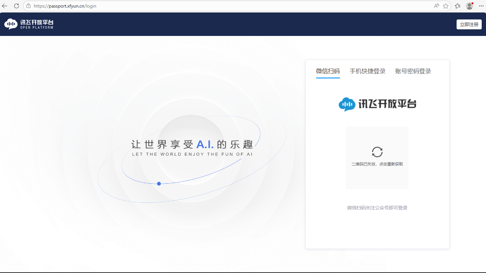
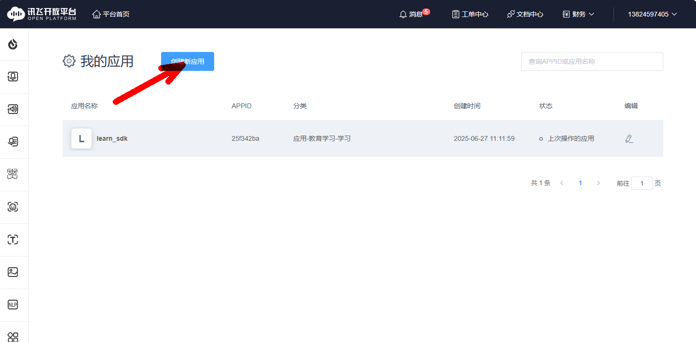
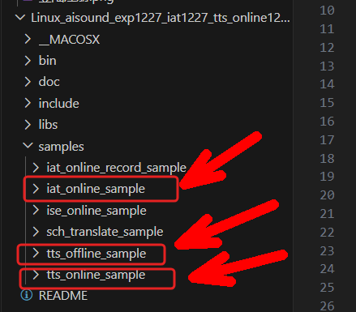
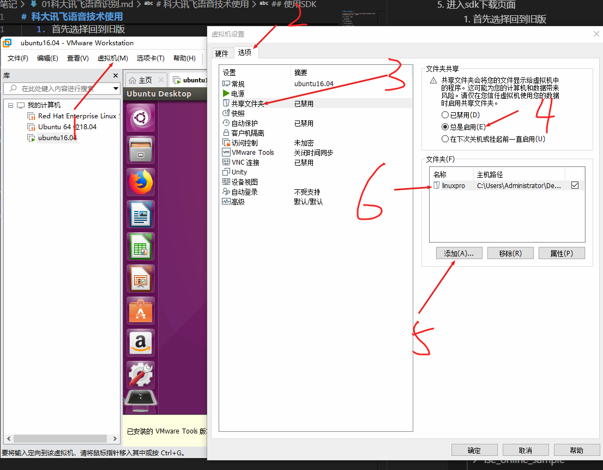
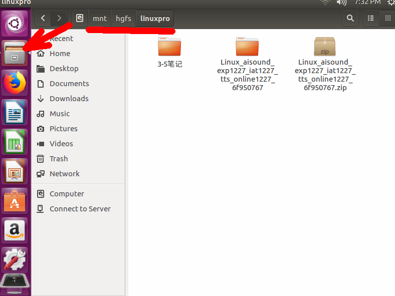
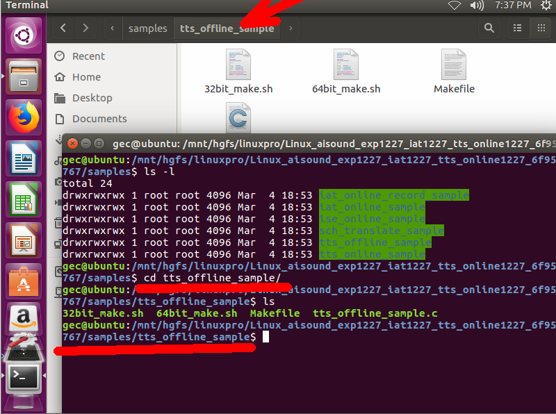
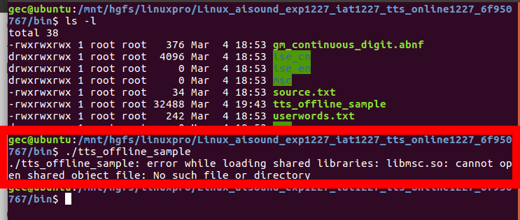

# 科大讯飞语音技术使用

1.在[https://passport.xfyun.cn/login](https://passport.xfyun.cn/login)登录注册讯飞开放平台



2. 点击控制台


3. 创建讯飞语音应用




4. 回到讯飞官网首页选择服务支持，点击SDK下载


5. 进入sdk下载页面
   1. 首先选择回到旧版
   2. 应用选择刚创建的应用 
   3. 平台选择linux
   4. 选择你想要使用的讯飞SDK能力
   5. 点击SDK下载


## 使用SDK

1. 解压SDK文件

   - iat_online_sample  语音识别
   - tts_offline_sample 离线文字转语音
   - tts_online_sample  在线文字转语音
   - 
2. 进入linux操作系统设置共享文件夹，让Ubuntu 可以访问刚才下载的sdk目录.(点击虚拟机 -> 设置 -> 选项)



3. 共享文件夹目录位置 /mnt/hgfs/


4. 使用终端cd访问到你想测试使用的案例功能目录下


   - 打开终端访问指定功能目录
```shell
cd /mnt/hgfs/你的共享文件夹
# 再cd进解压的科大讯飞项目目录中
cd Linux_aisound_exp1227_iat1227_tts_online1227_6f950767/
# 再cd samples 案例想要测试功能目录中
cd ./samples/tts_offline_sample/
```
   - 编译代码
```shell
# 科大讯飞提供的自动编译shell脚本
./64bit_make.sh 
```

5. 编译完毕后执行代码

   - 可执行文件被自动编译到了bin目录，首先先访问bin目录 
```shell
cd ../../bin/

# tts_offline_sample 语音合成可执行代码
# 运行它
./tts_offline_sample
``` 
  - 运行后发现编译报错


> 错误信息提示缺少 libmsc.so 动态库， 解决方案将该动态库添加到Ubuntu系统文件中

```shell
# 访问科大讯飞提供动态库目录中
cd ../libs/x86/
# 将其拷贝到Ubuntu
sudo cp libmsc.so /usr/lib
# 
[sudo] password for gec:
```
