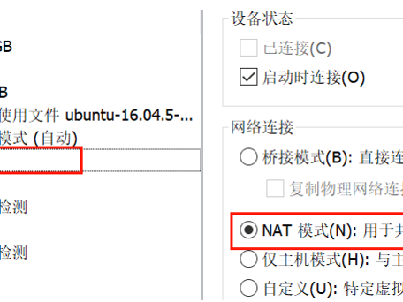
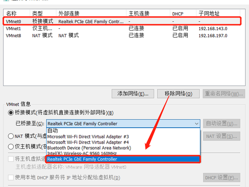
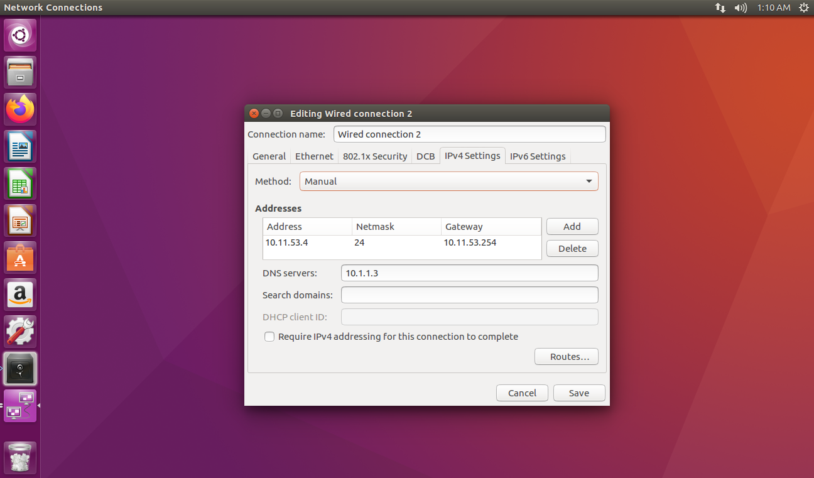

# 录音与科大讯飞对接

## 确保虚拟机的网络联通性

网卡 1：NAT 模式 → 走笔记本 WiFi，用来上外网。
网卡 2：桥接模式 → 桥接到笔记本有线网口，用来和开发板直连通信。


### 一、VMware 端配置（关键）
1. 关闭虚拟机，打开「编辑虚拟机设置」。
2. 网卡 1（NAT，用于上网）
    - 网络连接 → 选择 NAT 模式（默认 VMnet8）。
    


3. 添加网卡 2（桥接，用于连开发板）点击「虚拟机」-> 设置
    - 点击「添加」→ 网络适配器 → 完成。新网卡选择 桥接模式。



4. 配置桥接的物理网卡（必须选对）
    - 菜单栏：编辑 → 虚拟网络编辑器 → 更改设置（管理员权限）
5. 选中 VMnet0（桥接模式） → 桥接到：选择你笔记本的有线网卡（如 Realtek PCIe GbE），不要选 “自动”。
    - 点「应用」→「确定」。



### Ubuntu 虚拟机网络配置

1. 开机，打开终端输入 `ip a`，查看网卡：
    - ens33：NAT 网卡（自动获取，上外网用）
    - ens36：桥接网卡（需设静态 IP，连开发板）
```shell
1: lo: <LOOPBACK,UP,LOWER_UP> mtu 65536 qdisc noqueue state UNKNOWN group default qlen 1000
    link/loopback 00:00:00:00:00:00 brd 00:00:00:00:00:00
    inet 127.0.0.1/8 scope host lo
       valid_lft forever preferred_lft forever
    inet6 ::1/128 scope host 
       valid_lft forever preferred_lft forever
2: ens33: <BROADCAST,MULTICAST,UP,LOWER_UP> mtu 1500 qdisc pfifo_fast state UP group default qlen 1000
    link/ether 00:0c:29:ff:78:31 brd ff:ff:ff:ff:ff:ff
    inet 192.168.93.128/24 brd 192.168.93.255 scope global dynamic ens33
       valid_lft 1793sec preferred_lft 1793sec
    inet6 fe80::606d:4380:cd4d:535b/64 scope link 
       valid_lft forever preferred_lft forever
3: ens36: <BROADCAST,MULTICAST,UP,LOWER_UP> mtu 1500 qdisc pfifo_fast state UP group default qlen 1000
    link/ether 00:0c:29:ff:78:3b brd ff:ff:ff:ff:ff:ff
    inet6 fe80::9c61:7adf:7b2b:7306/64 scope link 
       valid_lft forever preferred_lft forever

```
2. 点击 Ubuntu 右边网络图标，选择`Edit Connections`
    - 选择 `Wired connection 2`点击 `Edit`

3. 选择`IPv4 Settings` 将 Method 改为 `Manual`

4. 填写 ip 地址，标准参照`week7笔记`中的 `## 开发板配置网络`配置对应的ip 网关 子网掩码 DNS。


5. 测试ubuntu是否可以通过网络链接开发板
    - ping 开发板ip

**补充**：有些同学按照上面的设置设置完成任然无法连接外网，这个与网卡优先级有关

**解决此问题**：打开终端
```shell
# 输入指令ip route 查看当前网卡状态
ip route

default via 10.11.53.254 dev ens33  proto static  metric 100 
default via 192.168.93.2 dev ens36  proto static  metric 101 

# 我们可以看到当前电脑有两张默认网卡 
# 其中 网关是 10.11.53.254 是我手动设置的桥接模式网卡，该网卡只用于直连开发板无法上外网，但是他成为默认网卡后Ubuntu会优先选择该网卡上外网导致无法上网

# 删除掉桥接模式对应的网卡的默认选项， 记得输密码
sudo route del default gw 10.11.53.254

default via 192.168.93.2 dev ens36  proto static  metric 101 

# 再输入ip route 用于查看是否只剩一张用于上外网的默认网卡了
```


### （选做）给开发板设置telnet协议，
Ubuntu和windows可以直接通过telnet协议控制开发板
    - 修改开发板配置文件 
```shell
vi /etc/profile

# 在文件末尾加
telnetd &
# 重启开发板
```

- Ubuntu中可以通过 `telnet 开发板ip`直接操作开发板，输入 `exit` 退出控制


